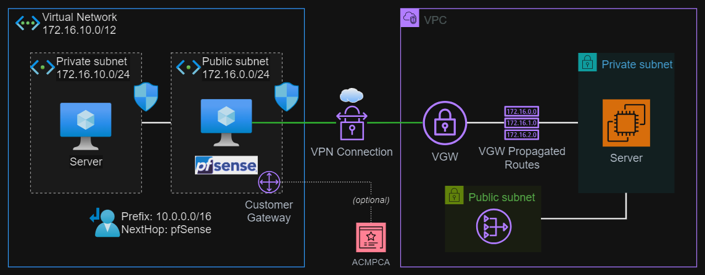

# AWS Site-to-Site VPN

IPSec connection between AWS VPN and Netgate pfSense from the Azure Marketplace.



## Setup

### 1. Create the Azure resources

Copy the `.auto.tfvars` template:

```sh
cp azure/config/template.tfvars azure/.auto.tfvars
```

Set your IP CIDR address for management of the Azure resources:

```terraform
local_administrator_cidr = "1.2.3.4"
```

> [!CAUTION]
> Watch out for the `enable_acmpca` variable. AWS ACM Private Certificate Authority is an expensive service with monthly fees. Do **not** set it to `true` unless you intend to do so.

Create a key pair to use for the Virtual Machines configuration:

```sh
mkdir azure/keys
ssh-keygen -f azure/keys/temp_key
chmod 600 azure/keys/temp_key
```

Init and apply the Terraform configuration:

```sh
terraform -chdir="azure" init
terraform -chdir="azure" apply -auto-approve
```

Connect with SSH and check VM startup script:

```sh
cloud-init status
```

Connect to pfSense and setup the initial WAN configuration:

- Username: `admin`
- Password: `pfsense`

Now, create the AWS infrastructure and continue the Azure configuration in the next section.


### 2. Create the AWS resources

Copy the `.auto.tfvars` template:

```sh
cp aws/config/template.tfvars aws/.auto.tfvars
```

Get the pfSense public IP running on Azure and set in the configuration:

```terraform
customer_gateway_ip_address = "1.2.3.4"
```

Init and apply the Terraform configuration:

```sh
terraform -chdir="aws" init
terraform -chdir="aws" apply -auto-approve
```

In the VPC console, open the VPN Connection and download the configuration:

- Vendor: `Generic`
- Platform: `Generic`
- Software: `Vendor Agnostic`
- IKE version: `ikev2`

Connect with SSM Session Manager and check the instance startup script:

```sh
cloud-init status
```

### 3. Set the AWS tunnel IPs into the Azure configuration

While in the AWS VPN section, get the `Outside IP address` for the IPSec tunnels.

Go back to the Azure configuration, and set the IP addresses for each tunnel:

```terraform
aws_remote_gateway_ip_address_tunnel_1 = "5.6.7.8"
aws_remote_gateway_ip_address_tunnel_2 = "4.3.2.1"
```

Re-apply the configuration:

```sh
terraform -chdir="azure" apply -auto-approve
```

### 4. Configure pfSense IPSec

#### IPSec

Follow the steps detailed in the instructions downloaded from AWS for a Generic provider, add Phase 1 and Phase 2 configuration in pfSense.


#### Firewall rules

Add the firewall to allow traffic within the tunnels:

- IPSec
- WAN

### 5. Testing

At this point, everything should be working and traffic flowing from both sides.

Run `ping` commands and calling NGINX from each side for testing.

## Let's Encrypt certificates

To protect pfSense with TLS, here's some guidelines to do that with Let's Encrypt.

### Installation (WSL)

Considering usage with WSL:

```sh
sudo -e /etc/wsl.conf
```

Add the configuration for `systemd`:

```toml
[boot]
systemd=true
```

Restart WSL:

```sh
wsl --shutdown
```

Follow the [instructions][1] to install **Certbot** into your box.

### Issue certificates

Issuing a certificate manually:

```sh
sudo certbot certonly --manual --preferred-challenges dns \
    -d <your domain> \
    -m <your email>
```

Location where the certifications will be available:

```
Certificate is saved at: /etc/letsencrypt/live/vpn-azure.example.com/fullchain.pem
Key is saved at:         /etc/letsencrypt/live/vpn-azure.example.com/privkey.pem
```

## Finding Azure images

Command used to find the pfSense marketplace image:

```sh
az vm image list --location eastus2 --publisher netgate --offer pfsense-plus-public-cloud-fw-vpn-router --sku pfsense-plus-public-tac-lite --all
```

Additional search commands:

```sh
az vm image list-publishers --location eastus2 --query [].name --output table | grep netgate
az vm image list-offers --location eastus2 --publisher netgate --output table
az vm image list-skus --location eastus2 --publisher netgate --offer pfsense-plus-public-cloud-fw-vpn-router --query [].name --output table
```

## Clean-up

Destroy both Azure and AWS resources:

```sh
terraform -chdir="azure" destroy -auto-approve
terraform -chdir="aws" destroy -auto-approve
```

## Reference

- [How to Setup Site to Site VPN between AWS and PFsense?](https://youtu.be/p83RmeT2Q-A)
- [Setup Site-to-Site VPN to AWS with pfSense](https://c86.medium.com/setup-site-to-site-vpn-to-aws-with-pfsense-1cac16623bd6)
- [IP Sec VPN Fundamentals](https://youtu.be/15amNny_kKI)
- [How do I create a certificate-based VPN using AWS Site-to-Site VPN?](https://www.youtube.com/watch?v=nz__4KBKIGE)


[1]: https://certbot.eff.org/
